# 📊 YATRIK ERP - Visual Test Execution Flow

---

## 🔄 Complete Test Execution Flow

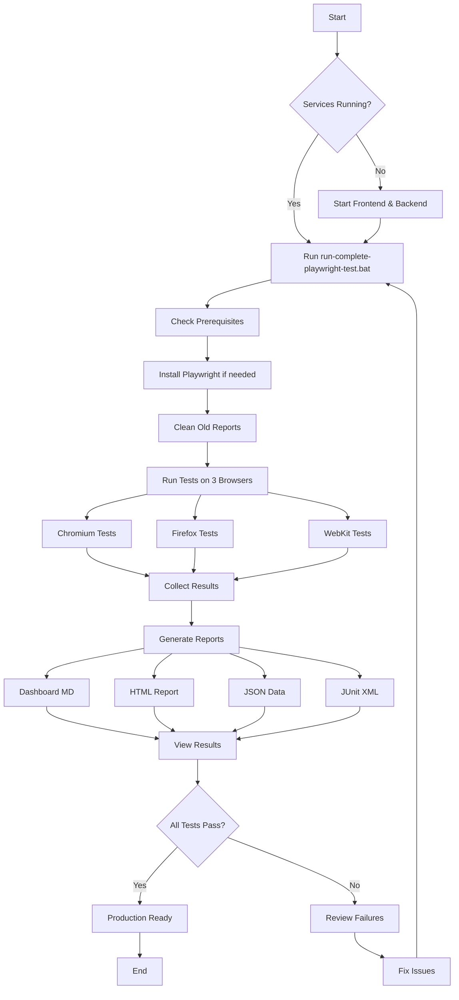

---

## 📋 Test Categories Flow

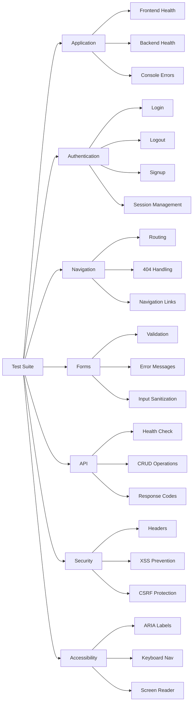

---

## 🌐 Browser Testing Flow

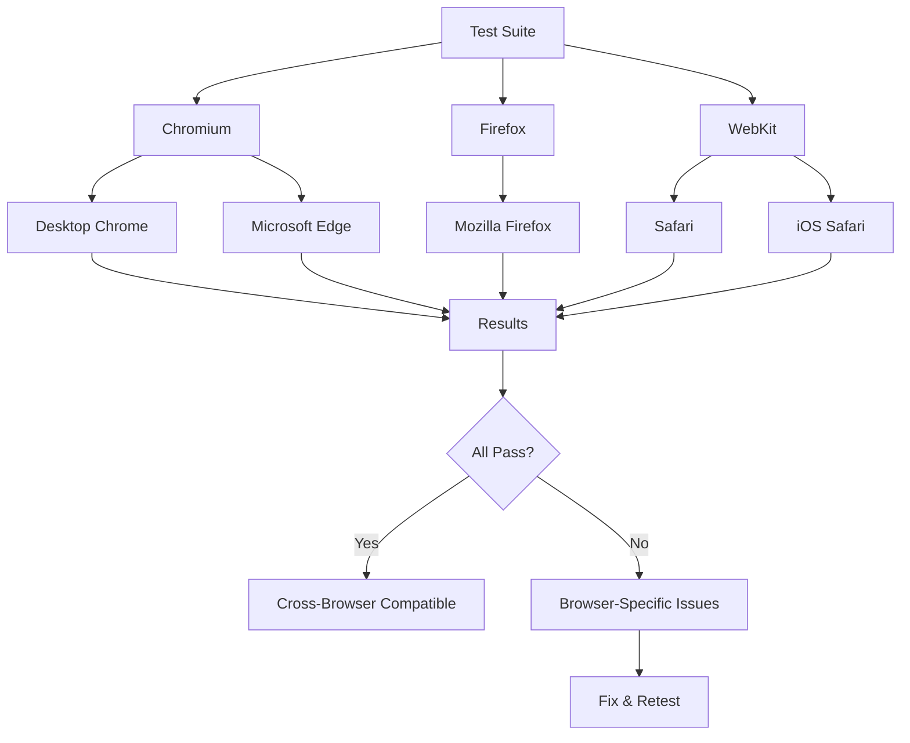

---

## 📊 Report Generation Flow

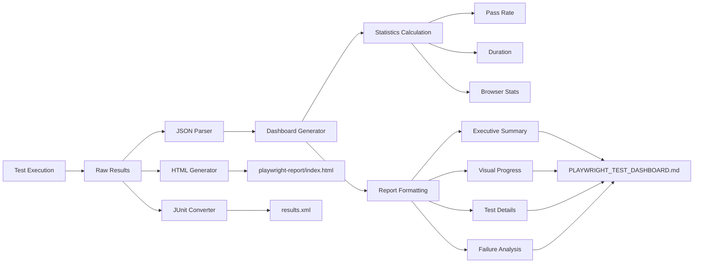

---

## 🎯 User Journey Test Flow

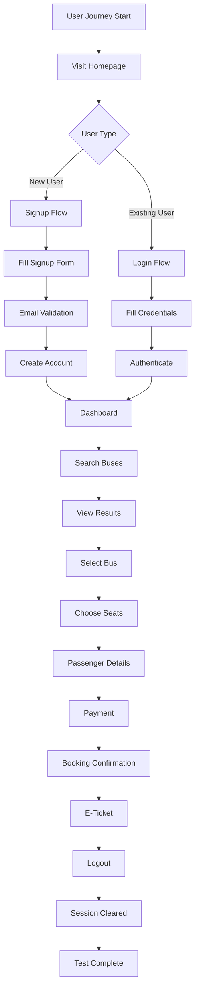

---

## 🔍 Failure Investigation Flow

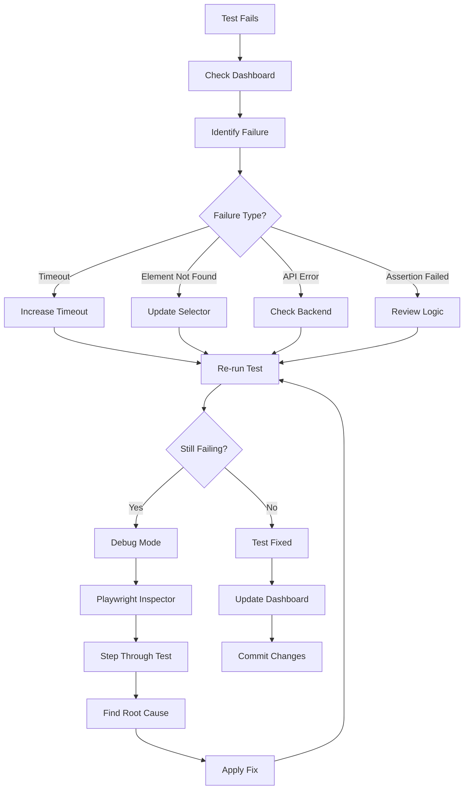

---

## 🚀 CI/CD Integration Flow

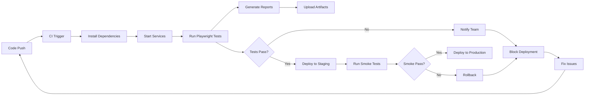

---

## 📈 Quality Gate Flow

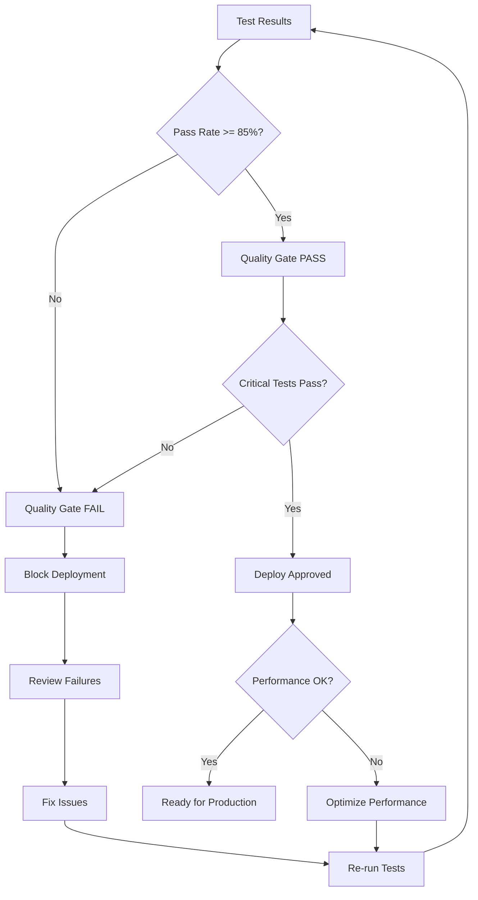

---

## 🎨 Dashboard Content Flow

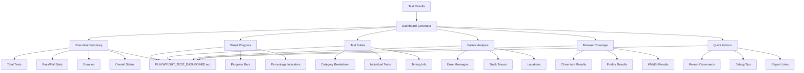

---

## 🔄 Continuous Testing Flow

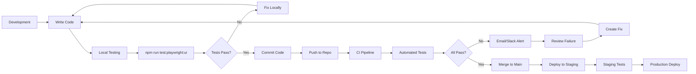

---

## 🎯 Quick Command Flow

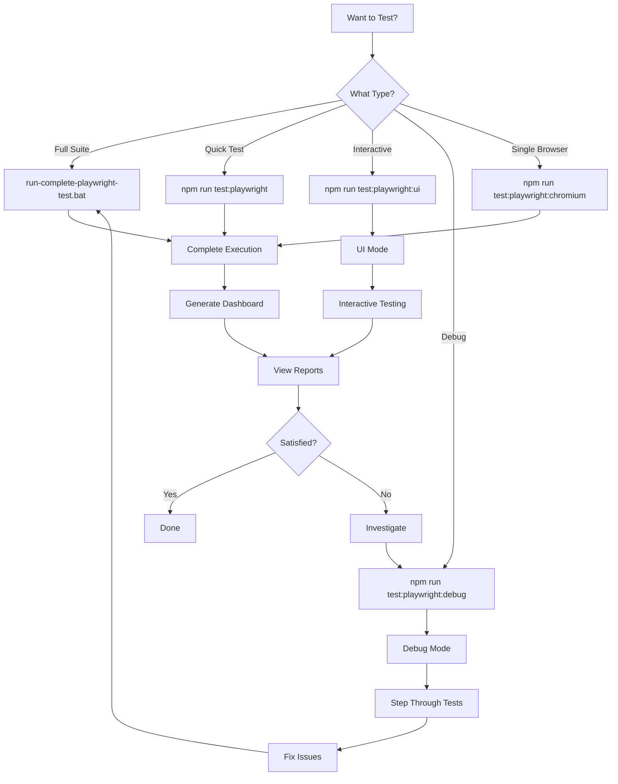

---

## 📊 Report Types Decision Flow

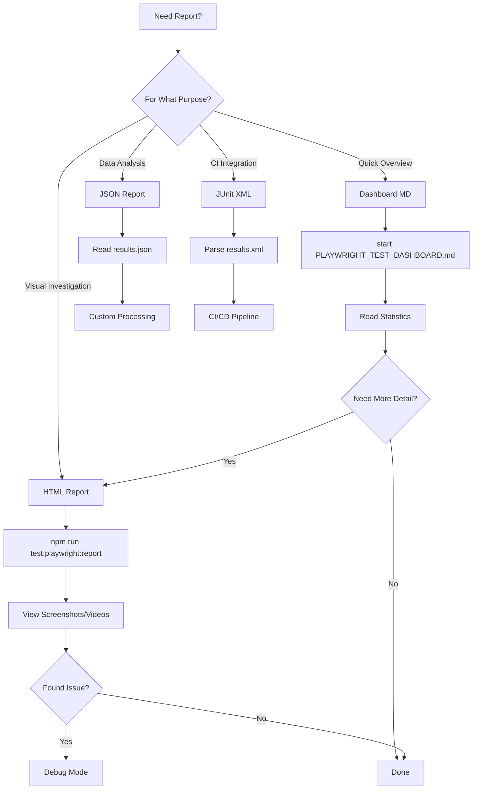

---

## 🎓 Learning Flow

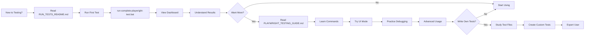

---

**Visual Guide Complete!** 🎨  
**Use these flows to understand the testing infrastructure**
